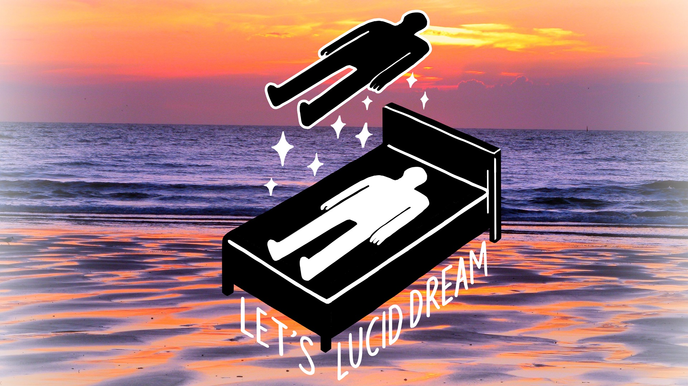

# awesome-lucid-dream

> Picture Credit: [What Is Lucid Dreaming](https://lifehacker.com/what-is-lucid-dreaming-and-how-do-i-get-started-1795552901)

## What is Lucid Dream

1. [Wikipedia: Lucid Dream](https://en.wikipedia.org/wiki/Lucid_dream)
1. [What Is Lucid Dreaming and How Do I Get Started?](https://lifehacker.com/what-is-lucid-dreaming-and-how-do-i-get-started-1795552901)

[<image src="docs/images/lucid-dreamer-badge.jpg" width="100" />](https://dribbble.com/shots/2972777-Lucid-Dreamer-Patch-Design#shot-description)

## Videos

1. [How Lucid Dreaming Works](https://www.youtube.com/watch?v=qH-MGqokk_Y)
1. [Sleep Paralysis Isn't As Rare as You Think](https://www.youtube.com/watch?v=PXaB89dPQlw)

## Books

1. [Навыки ясного сна](https://lucid.gitbooks.io/lds/)

## Softwares

1. [Lightened Dream - A free and open source dream journal designed for dreamers in search for lucidity.](https://lucidcode.com/lighteneddream/)

## Articles

1. [Lucid dreamer reveals the benefits and risks of controlling your dreams](https://therooster.com/blog/lucid-dreamer-reveals-benefits-and-risks-controlling-your-dreams)
1. [The Benefits and Risks of Lucid Dreaming](https://lifehacker.com/the-benefits-and-risks-of-lucid-dreaming-1795735303)

## Sticker

1. [Lucid Dreamer Sticker](https://jefffinley.org/product/lucid-dreamer-sticker/)

## Author

1. [Huan LI (李卓桓)](http://linkedin.com/in/zixia) \<zixia@zixia.net\>
1. [Grace LI (李佳芮)](https://angel.co/lijiarui)

## COPYRIGHT & LICENSE

* Code & Docs © 2016-now Huan LI \<zixia@zixia.net\>
* Code released under the Apache-2.0 License
* Docs released under Creative Commons
